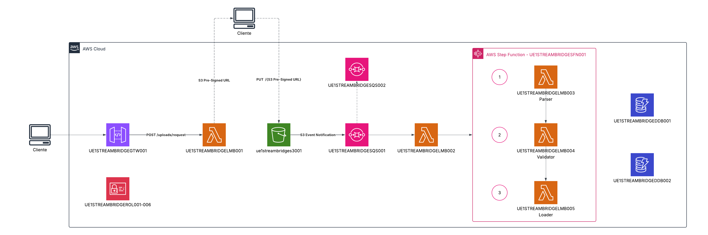

# StreamBridge

Pipeline ETL serverless orquestado para ingesta de archivos (CSV, Excel, XML, TXT). El cliente solicita una URL prefirmada de S3, sube el archivo directamente y eso dispara automáticamente una ejecución de Step Functions que orquesta tres Lambdas independientes: **parser → validator → loader**. Cada paso actualiza el estado del job en DynamoDB y un catch global marca el job como `FAILED` ante cualquier error no recuperable.

---

## Índice

- [Arquitectura](#arquitectura)
  - [Flujo end-to-end](#flujo-end-to-end)
  - [Recursos AWS](#recursos-aws)
  - [Modelo de datos](#modelo-de-datos)
  - [Layout S3](#layout-s3)
- [API Reference](#api-reference)
  - [Endpoints](#endpoints)
  - [Códigos de error](#códigos-de-error)
- [Estados del job](#estados-del-job)
- [Instalación y desarrollo local](#instalación-y-desarrollo-local)
- [Desarrollo en LocalStack](#desarrollo-en-localstack)
- [Despliegue en AWS](#despliegue-en-aws)
- [CI/CD](#cicd)

---

## Arquitectura

> Diagrama: `docs/architecture.png`


### Flujo end-to-end

```
Cliente
  │  POST /v1/uploads/request
  ▼
upload-request (Lambda)
  ├─ presigned URL (TTL 15min) → S3 raw-uploads/
  └─ DynamoDB job → PENDING (+ expiresAt TTL)
  │
  │  PUT directo del cliente al uploadUrl
  ▼
S3 raw-uploads/{clientId}/{YYYY-MM-DD}/{jobId}/{filename}
  │  S3 Event Notification
  ▼
SQS file-ingestion-queue (+ DLQ)
  │  batchSize: 1 — maxConcurrency: 10
  ▼
pipeline-trigger (Lambda)
  ├─ Idempotencia: si job.status != PENDING → skip
  ├─ Inicia ejecución Step Functions
  └─ DynamoDB job → PROCESSING (REMOVE expiresAt)
  │
  ▼
Step Functions Standard
  ├─► parser    → PARSED            (S3 staging/{jobId}/parsed.json)
  ├─► validator → VALIDATED | VALIDATION_FAILED
  │              (S3 staging/{jobId}/validation-report.json)
  ├─► loader    → DONE              (S3 processed/{clientId}/{YYYY}/{MM}/{DD}/{jobId}.json)
  └─► catch     → DynamoDB SDK Integration: status = FAILED
```

### Recursos AWS

| Recurso | Descripción |
|---|---|
| API Gateway HTTP API | Entry point para `upload-request` (con API Key) |
| Lambda × 5 | `upload-request`, `pipeline-trigger`, `parser`, `validator`, `loader` |
| SQS + DLQ | Buffer de eventos S3 contra bursts de subidas |
| Step Functions Standard | Orquestación del pipeline (Retry: 2 intentos, backoff exponencial) |
| S3 (1 bucket, 3 prefijos) | `raw-uploads/` (TTL 30d), `staging/` (TTL 7d), `processed/` (sin TTL) |
| DynamoDB × 2 | `stream-bridge-jobs` (con TTL) y `stream-bridge-schemas` (registry multi-tenant) |
| CloudWatch | Logs por Lambda + métricas del pipeline |

### Modelo de datos

**`stream-bridge-jobs`** — `PK: jobId`

| Campo | Tipo | Notas |
|---|---|---|
| `clientId`, `filename`, `contentType` | string | metadata original |
| `status` | enum | ver [Estados del job](#estados-del-job) |
| `sourceFormat` | `csv` \| `excel` \| `xml` \| `txt` | detectado por el parser |
| `checksum` | string | SHA-256 del contenido original |
| `totalRows`, `validRows`, `invalidRows`, `fileSizeKb` | number | métricas del pipeline |
| `sourceKey`, `stagedKey`, `processedKey` | string | rutas en S3 |
| `createdAt`, `updatedAt`, `completedAt` | ISO timestamp | audit trail |
| `failedStep`, `errorMessage`, `errorCause` | string? | sólo si `status = FAILED` |
| `expiresAt` | epoch | TTL — sólo en `PENDING`, eliminado al pasar a `PROCESSING` |

**`stream-bridge-schemas`** — `PK: clientId` / `SK: schemaVersion`

| Campo | Tipo | Notas |
|---|---|---|
| `zodSchema` | JSON | definición de campos requeridos, tipos, rangos |
| `validationPolicy` | `STRICT` \| `LENIENT` | STRICT: 1 error = fallo; LENIENT: falla si `errors > umbral %` |
| `errorThresholdPct` | number | sólo aplica en `LENIENT` |
| `active` | boolean | el validator lee sólo `active: true` |
| `parserConfig` | JSON? | config opcional. Para TXT: `{ delimiter: '\|' \| '\t' }` |

### Layout S3

```
raw-uploads/{clientId}/{YYYY-MM-DD}/{jobId}/{filename}   ← TTL 30d
staging/{jobId}/parsed.json                              ← TTL 7d
staging/{jobId}/validation-report.json                   ← TTL 7d
processed/{clientId}/{YYYY}/{MM}/{DD}/{jobId}.json       ← sin TTL
```

---

## API Reference

Todas las rutas requieren el header `x-api-key`.

### Endpoints


#### `POST /v1/uploads/request`

Genera una URL prefirmada para subir un archivo y crea el job en `PENDING`.

**Request body:**
```json
{
  "clientId": "ac-farma",
  "filename": "inventario-distribuidora-norte.csv",
  "contentType": "text/csv"
}
```

`contentType` válidos:

| MIME type | Formato |
|---|---|
| `text/csv` | CSV |
| `application/vnd.openxmlformats-officedocument.spreadsheetml.sheet` | Excel (.xlsx) |
| `application/xml`, `text/xml` | XML |
| `text/plain` | TXT (delimiter configurado por cliente en el schema registry) |

**Response `201`:**
```json
{
  "data": {
    "jobId": "9c1f8b3e-...",
    "uploadUrl": "https://stream-bridge.s3.us-east-1.amazonaws.com/raw-uploads/...",
    "expiresIn": 900
  }
}
```

> El cliente debe hacer `PUT` al `uploadUrl` con el archivo en el body y el header `Content-Type` exacto al declarado. Tras la subida, el pipeline arranca automáticamente.

---

### Códigos de error

```json
{ "code": "JOB-006", "description": "Ya existe un job activo para este cliente y archivo" }
```

| Código | HTTP | Descripción |
|---|---|---|
| `APP-001` | 500 | Error inesperado |
| `APP-002` | 500 | Variable de entorno requerida no encontrada |
| `APP-003` | 400 | El cuerpo de la solicitud no es válido |
| `APP-004` | 503 | DynamoDB no disponible |
| `APP-005` | 503 | S3 no disponible |
| `APP-006` | 503 | Step Functions no disponible |
| `JOB-001` | 400 | `clientId` vacío |
| `JOB-002` | 400 | `filename` con caracteres no permitidos |
| `JOB-003` | 400 | `contentType` no soportado |
| `JOB-004` | 404 | Job no existe |
| `JOB-005` | 422 | S3 key con formato inesperado |
| `JOB-006` | 409 | Ya existe un job activo para ese cliente y archivo |
| `JOB-007` | 409 | El job no está en un estado válido para esta operación |
| `PARSER-001` | 422 | Formato de archivo no soportado |
| `PARSER-002` | 422 | El archivo no contiene filas de datos |
| `PARSER-003` | 422 | Input recibido desde Step Functions inválido o incompleto |
| `INFRA-001` | 404 | El archivo solicitado no existe en S3 |
| `VALIDATOR-001` | 404 | No hay schema activo registrado para el cliente |
| `VALIDATOR-002` | 422 | El archivo no superó la validación según la política configurada |

---

## Estados del job

```
PENDING ──► PROCESSING ──► PARSED ──► VALIDATED ──► DONE
   │             │            │            │
   │             │            │            └──► VALIDATION_FAILED
   │             │            │
   └─────────────┴────────────┴──► FAILED  (catch global de Step Functions)
```

| Estado | Lo escribe | Significa |
|---|---|---|
| `PENDING` | `upload-request` | Job creado, esperando subida del archivo (con TTL) |
| `PROCESSING` | `pipeline-trigger` / reconciliación de `parser` | Pipeline iniciado |
| `PARSED` | `parser` | Archivo normalizado a JSON canónico en `staging/` |
| `VALIDATED` | `validator` | Pasó la validación según la política del cliente |
| `VALIDATION_FAILED` | `validator` | Reporte generado pero no superó la política |
| `DONE` | `loader` | Datos finales escritos en `processed/` |
| `FAILED` | Catch SFN (SDK Integration) | Error no recuperable en cualquier paso |

---

## Instalación y desarrollo local

```bash
npm install

# Tests BDD (jest-cucumber, Gherkin en español)
npm test

# Coverage
npm test -- --coverage
```

Los tests cubren `src/*/domain/service/**` y `src/*/domain/entities/**` con un threshold de 80% en lines/functions/branches/statements.

---

## Desarrollo en LocalStack

> Copiar `.env.example` a `.env` y completar `LOCALSTACK_AUTH_TOKEN`.

```bash
docker compose up -d

# CLI (una sola vez)
npm install -g aws-cdk aws-cdk-local
pip install awscli-local

cd cdk
cdklocal bootstrap
CDK_STAGE=local cdklocal deploy --require-approval never
```

### Runners locales

```bash
# Carga schemas de ejemplo en DynamoDB local
npx ts-node local-test/seed-schemas.ts
```

Archivos de ejemplo para probar el pipeline en `local-test/samples/` (CSV, XML, TXT de AC Farma y Prima AFP).

---

## Despliegue en AWS

```bash
cdk bootstrap aws://<ACCOUNT_ID>/us-east-1

CDK_STAGE=dev cdk diff
CDK_STAGE=dev cdk deploy --require-approval never
CDK_STAGE=dev cdk destroy
```

> Endpoint: `https://{id}.execute-api.us-east-1.amazonaws.com/{stage}/v1/{path}`

---

## CI/CD

### Pipelines

| Archivo | Trigger | Acción |
|---|---|---|
| `dev.yml` | `push` a `develop` | Deploy en AWS DEV |
| `qa.yml` | `push` a `release` | Deploy en AWS QA |
| `prd.yml` | `push` a `master` | Deploy en AWS PRD |
| `destroy.yml` | Manual (`workflow_dispatch`) | Destruye el stack del stage seleccionado |

### Secretos requeridos

Configurar en GitHub → Settings → Environments:

**`deployer-dev` / `deployer-qa` / `deployer-prd`:**
```
AWS_ACCESS_KEY_ID
AWS_SECRET_ACCESS_KEY
CDK_DEFAULT_ACCOUNT
AWS_DEFAULT_REGION
```